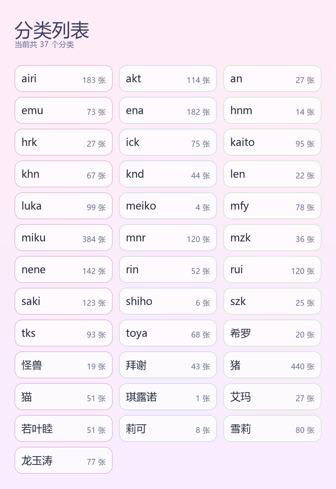

# 🌸 Airi Gallery

> **输入「看看」或「看全部」→ 画廊轻轻跳出来。**  
> 一个把图片按分类、按编号整理好的 AstrBot 轻量图库插件。

---

## ✨ 核心亮点

| 特性 | 描述 |
| :--- | :--- |
| 🗂️ **数字画廊** | 图片按分类保存，文件名自动整理为数字序号，方便查看、删除和导入 |
| 🪄 **轻量触发** | 使用 `看看<分类>`、`看看123`、`看全部<分类>` 快速取图 |
| 🎨 **图片化输出** | 帮助说明和分类列表都以海报图片输出，更适合聊天窗口阅读 |
| 🔐 **权限控制** | 支持可选管理员与白名单控制，保护创建、上传、删除等操作 |
| 🧹 **自动整理** | 启动或导入时自动重排编号，保持图库结构整洁 |

## 📦 文件说明

| 文件 | 说明 |
| :--- | :--- |
| `main.py` | 插件入口与核心逻辑 |
| `metadata.yaml` | 插件元数据 |
| `_conf_schema.json` | 插件配置说明 |
| `requirements.txt` | 依赖声明 |

## 🎮 使用指南

### 1. 帮助海报

输入 `/airi_gallery` 获取帮助海报：

### 2. 查看图片

| 命令 | 说明 |
| :--- | :--- |
| `看看<分类>` | 从对应分类里随机返回一张图片或表情包；也可在配置里切到 `/看看<分类>` |
| `看看<分类> N` | 随机返回 `N` 张，`N` 最大为 `5`；也可在配置里切到 `/看看<分类> N` |
| `看全部<分类>` | 输出该分类下全部图片的总览图，并标注序号；也可在配置里切到 `/看全部<分类>` |
| `看看123` | 返回编号为 `123` 的图片或表情包；也可在配置里切到 `/看看123` |

### 3. 查看分类列表

输入 `/分类列表` 查看所有分类：

### 4. 管理图片

| 命令 | 说明 |
| :--- | :--- |
| `/创建<分类>` | 创建一个新的分类文件夹 |
| `/上传<分类>` | 回复图片后上传到指定分类 |
| `/删除123` | 删除编号为 `123` 的图片或表情包 |
| `/导入图库` | 重新扫描图库并整理编号 |

> 如果开启了 `use_permission`，上述管理命令只允许 `admins` 或 `whitelist` 里的用户执行。

### 5. 触发模式

| 模式 | 说明 |
| :--- | :--- |
| `view_command_mode = no_prefix` | 默认模式，使用 `看看<分类>` / `看看123` |
| `view_command_mode = prefix` | 前缀模式，使用 `/看看<分类>` / `/看看123` |

> 说明：只有 `看看`、`看全部`、`看看123` 这组浏览命令可切换是否使用 `/` 前缀，其余命令固定使用 `/`。

## 📁 存储结构

| 位置 | 说明 |
| :--- | :--- |
| `data/plugin_data/astrbot_plugin_airi_gallery/gallery/` | 默认图库目录 |
| `gallery/分类名/1.png` | 示例：某个分类下的数字编号图片 |

文件名统一使用数字序号，插件会按编号支持查看、删除与重新整理。

## 🧭 命令速查表

| 命令 | 权限 | 说明 |
| :--- | :---: | :--- |
| `看看<分类>` / `/看看<分类>` | 全员 | 随机发送一张图片或表情包 |
| `看看<分类> N` / `/看看<分类> N` | 全员 | 随机发送 `N` 张图片或表情包 |
| `看全部<分类>` / `/看全部<分类>` | 全员 | 生成分类总览图 |
| `看看123` / `/看看123` | 全员 | 按编号查看图片 |
| `/分类列表` | 全员 | 查看分类卡片列表 |
| `/创建<分类>` | 管理员 | 创建新分类 |
| `/上传<分类>` | 管理员 | 上传图片到指定分类 |
| `/删除123` | 管理员 | 删除指定编号图片 |
| `/导入图库` | 管理员 | 重排图库编号 |

## 🔐 权限配置说明

| 配置项 | 作用 | 填写建议 |
| :--- | :--- | :--- |
| `use_permission` | 是否开启管理命令权限控制 | `true` 后才会检查 `admins` 和 `whitelist` |
| `admins` | 管理员名单 | 适合放“长期管理员”，会放行全部受权限控制的管理命令 |
| `whitelist` | 白名单 | 适合临时授权给少数用户执行管理命令 |

`admins` 和 `whitelist` 都可以填写 AstrBot 能识别到的用户标识，通常包括 QQ 号，也可以是用户名或平台返回的 UID。优先建议填你在 `/sid` 里看到的用户 ID，这样最稳定。

## 💡 小提示

- 插件启动时会自动整理图库中的数字编号。
- 如果你手动把图片拖进本地图库目录，启动后也会自动重新编号。
- 帮助海报和分类列表直接以图片形式输出，更适合聊天中快速查看。

---

**Made with 💕 by Lidure**  
简单、整洁地管理你的数字画廊。

