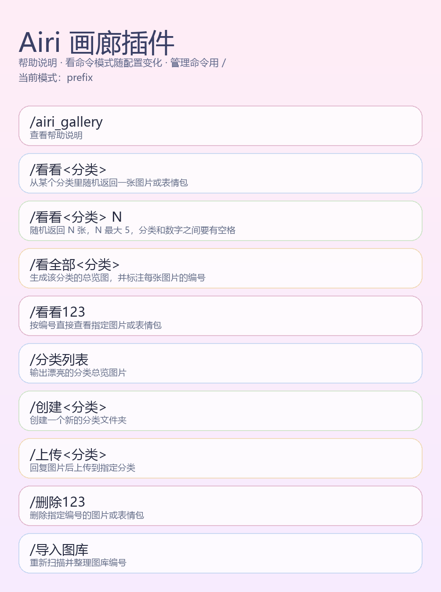
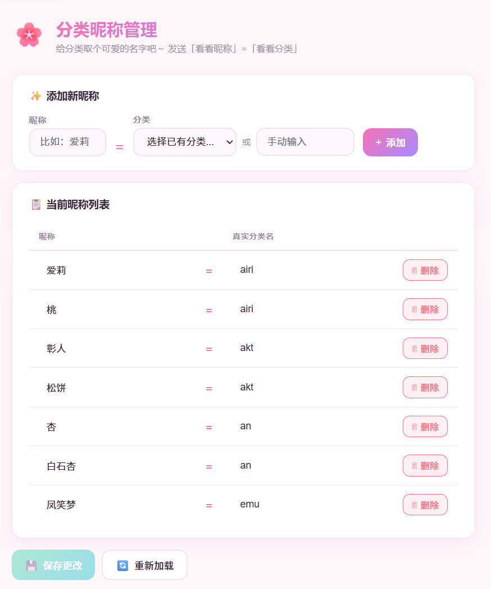
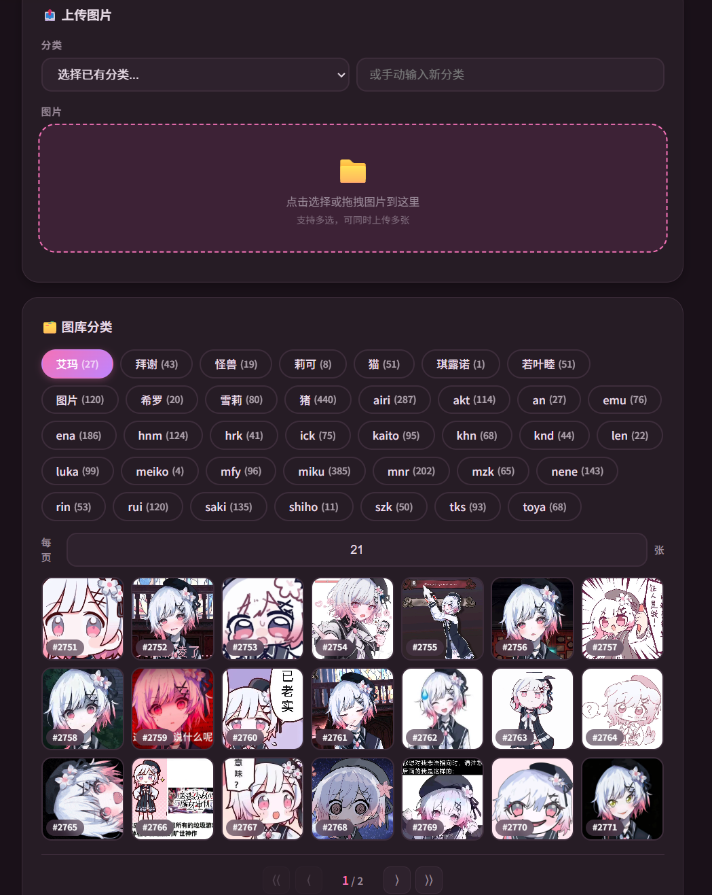

<div align="center">

# 🌸 Airi Gallery

> **输入「看看」或「看全部」→ 画廊轻轻跳出来。**  
> 一个把图片按分类、按编号整理好的 AstrBot 图库插件，支持 LLM 自动发表情包。

[](https://github.com/Soulter/AstrBot)
[](https://www.python.org/)
[]()
[]()

<a href="https://count.getloli.com" target="_blank">
	
</a>

</div>
---

## 🖼️ 作者的图库

分享一下我自己的图库：

点击 [Lidure的图库](https://github.com/Lidure/airi-gallery-images/tree/main/gallery) 查看作者图库

可以直接clone到本地，也可以选择自己喜欢的图进行下载哦~

方便大家建立初期的图库

---

## ✨ 核心亮点

| 特性 | 描述 |
| :--- | :--- |
| 🗂️ **数字画廊** | 图片按分类保存，文件名自动整理为数字序号，方便查看、删除和导入 |
| 🪄 **轻量触发** | 使用 `看看<分类>`、`看看123`、`看全部<分类>` 快速取图 |
| 🎨 **图片化输出** | 帮助说明、分类列表和昵称映射都以海报图片输出 |
| 🔐 **权限控制** | 支持可选管理员与白名单控制，保护创建、上传、删除等操作 |
| 🧹 **双端一致整理** | `/导入图库` 使用同一份全局 1..N 映射整理本地与 GitHub；远程状态不明时不单独改本地编号 |
| 🔗 **合并转发** | 多图查看支持合并转发模式，告别刷屏 |
| 🤖 **LLM 工具** | 接入 LLM Function Calling，让 AI 在对话中自动发表情包 |
| 🏷️ **分类昵称** | 为分类设置多个别名，「看看爱莉」等同于「看看airi」 |
| 🌐 **统一管理页** | 在默认 Web UI 中浏览、上传图库并可视化管理分类昵称 |
| ☁️ **Git 远程同步** | 图片自动同步到 GitHub / Gitee 仓库，支持定时拉取与批量推送 |
| 🖥️ **云端管理页** | 独立 Cloudflare Pages SPA，暗色模式、紧凑分页，无需 Bot 在线即可管理图片 |
| 📤 **公开上传** | 通过 `upload_token` 密钥控制外部上传权限，支持网页端直接传图 |
| 🧬 **分层统一查重** | 每张候选图的精确指纹与 64-bit dHash 各计算一次并复用：完全重复直接拦截并提示原图序号/图片，相似图片显示候选并允许明确强制上传 |
| 🔢 **全局编号** | 本地插件和云端页面都按全局最大编号续号，跨分类排序更一致 |
| ⚡ **哈希索引缓存** | 本地保存图片哈希索引，重启后无需重新读取几千张图片计算哈希 |
| 🔄 **立即同步** | `/立即同步` 手动从远程拉取新增图片，不必等待定时同步 |
| ⏹️ **推送控制** | `/推送` 批量同步本地图片，`/取消推送` 随时中断 |

## 📦 文件说明

| 文件 | 说明 |
| :--- | :--- |
| `main.py` | 插件入口与核心逻辑 |
| `metadata.yaml` | 插件元数据 |
| `_conf_schema.json` | 插件配置说明 |
| `requirements.txt` | 依赖声明 |
| `pages/gallery/` | 本地图库与分类昵称统一管理页面（HTML / CSS / JS） |
| `pages/zz_cloud/` | 云端管理页面（独立 SPA，部署到 Cloudflare Pages，后置命名以便 `gallery` 成为插件页默认入口） |
| `assets/` | 角标图片等静态资源 |

## 🎮 使用指南

### 1. 帮助海报

输入 `/airi_gallery`、`/画廊帮助` 或 `/图库帮助` 获取帮助海报：

<div align="center">




</div>

### 2. 查看图片

| 命令 | 说明 |
| :--- | :--- |
| `看看<分类>` | 从对应分类里随机返回一张图片或表情包 |
| `看看<分类> N` | 随机返回 `N` 张，`N` 最大为 `10` |
| `/抽表情` / `/抽表情 N` | 从全图库随机抽取图片或表情包，默认 1 张，`N` 最大为 `10` |
| `看全部<分类>` | 输出该分类下全部图片的总览图，并标注序号 |
| `看看123` | 返回编号为 `123` 的图片或表情包 |
| `看100-110` | 按编号范围连续返回 `100` 到 `110` 的图片或表情包，最多 50 张 |

> `看看` / `看全部` / 编号查看可在配置中切换是否使用 `/` 前缀；`/抽表情` 固定使用 `/` 前缀，避免普通聊天误触发。

### 3. 多图发送模式

使用 `看看<分类> N` 时，可选择不同的发送方式：

| 模式 | 说明 |
| :--- | :--- |
| `single`（默认） | 将 N 张图片打包在一条消息中发送 |
| `forward` | 只发送一条合并转发消息，内部每张图独立为一条转发节点，方便收藏表情（仅 OneBot 等支持合并转发的平台生效） |

### 4. 分类昵称（别名）

在配置中设置 `category_aliases`，格式为 `昵称=分类名`：

```
爱莉=airi
小猫=cat
表情包=emoji
```

设置后发送「看看爱莉」等同于「看看airi」，所有涉及分类名的命令（看看、看全部、上传、创建）均支持别名。

输入 `/昵称列表` 可以图片形式查看当前所有昵称映射：

<div align="center">



</div>

也可以通过插件内置的 **Web UI 管理页面** 可视化管理昵称（详见下方 [Web UI 管理页面](#-web-ui-管理页面) 章节）。

### 5. LLM 表情包工具

开启 `llm_tool_enabled` 后，LLM 可以在对话中自动调用 `gallery_send` 工具来发送表情包/图片。

**工具参数：**

| 参数 | 类型 | 必填 | 说明 |
| :--- | :--- | :---: | :--- |
| `category` | string | 否 | 分类名、分类昵称或用户原话里的分类关键词，留空则插件会尝试从用户消息中匹配 |
| `count` | integer | 否 | 发送数量，默认 1，最大 5 |

LLM 会在合适的对话场景中自动判断是否需要发表情包，并调用此工具。比如用户说「发一张 airi 的表情包」，工具会优先匹配 `airi` 分类；如果设置了昵称，也会和聊天命令一样参与匹配。

### 6. 查看分类列表

输入 `/分类列表` 或 `/查看画廊` 查看所有分类：

<div align="center">


</div>

### 7. 管理图片

| 命令 | 说明 |
| :--- | :--- |
| `/创建<分类>` | 创建一个新的分类文件夹 |
| `/上传<分类>` | 回复图片、多图或合并转发聊天记录后上传到指定分类，单次最多 100 张 |
| `/删除123` | 删除编号为 `123` 的图片或表情包 |
| `/去重图库` | 扫描并删除图库中重复图片，保留每个分类内首次出现的文件 |
| `/去重图库 <分类>` / `/去重 <分类>` | 只清理指定分类中的重复图片 |
| `/导入图库` | 重新扫描图库并整理编号 |
| `/画廊检查` | 只读检查配置、权限、远程连接和插件更新 |

> 在共享群组中强烈建议开启 `use_permission`。开启后，上述管理命令只允许 `admins` 或 `whitelist` 里的用户执行；保持关闭时，所有用户都可以运行管理命令。

### 新手排障

发送 `/画廊检查` 可以检查本地图库、配置、权限保护、Git 远程连接、云端图库链接格式和插件更新。它是只读检查：不会上传、删除文件、改写配置或重建索引。

- **正常**：该项可用或不需要额外处理。
- **警告**：插件仍可使用，但建议按提示调整配置，例如共享群组未开启权限保护。
- **错误**：该项暂时不可用，请按报告中的建议修复配置、路径或远程连接。
- **更新**：发现新版本时只会提示更新，不会自动更新；版本检测的网络失败也不会影响图库使用。

插件启动时也会运行同一组检查，但结果只会出现在 AstrBot 日志中，不会主动发送聊天消息。Git 检查中的“写权限未能确认”不等于“没有写权限”：只读连接无法可靠证明写权限，诊断不会通过上传测试文件来验证。

`/画廊检查` 的访问规则按 `use_permission` 配置决定：`false` 时所有用户都可执行；`true` 时仅 AstrBot 管理员、`admins` 或 `whitelist` 中的用户可执行。

安全更新步骤：先备份插件配置和图库数据，再通过 AstrBot 插件管理器更新，或从官方仓库替换插件；重启 AstrBot 后发送 `/画廊检查` 确认状态。

### 8. Git 远程仓库同步

开启 Git 同步后，图片上传和删除操作会自动同步到 GitHub 或 Gitee 远程仓库。远程仓库作为主存储，本地仅作为缓存，Bot 离线时也可通过 Git 平台网页直接管理图片。

**配置步骤：**

1. 在 GitHub 或 Gitee 上创建一个仓库（公开或私有均可），用于存放图片
2. 生成访问令牌：GitHub 需要 Personal Access Token（勾选 `repo` scope），Gitee 需要私人令牌
3. 在 AstrBot 配置中填写 Git 同步相关配置项（见下方配置表）
4. 重启 Bot，插件会自动拉取远程图片并在后续操作中保持同步

**同步行为：**

- 启动时自动从远程仓库拉取所有图片到本地
- 每次上传/删除图片后，自动推送到远程仓库
- 启动时如果本地有未推送的图片，会自动推送到远程
- 可配置定时器，定期从远程拉取新增图片（默认每 5 分钟）
- 使用 `/推送` 可手动快速推送本地新增或变更图片，远程已存在且内容一致的图片会直接跳过
- 直接在本地文件夹删除图片后，可使用 `/推送本地删除` 生成远程删除预览；必须在 5 分钟内使用带准确数量的 `/确认推送本地删除 N` 才会执行
- 本地删除预览只包含有已验证远程基线的图片。旧版哈希索引需要先成功执行一次 `/立即同步` 或 `/推送到远程`，才能让已删除文件进入预览
- 预览会跳过远程 SHA 已变化的文件，并显示跳过原因；确认时会再次核对本地文件和远程 SHA，避免误删 Cloud 新增或已发生变化的图片
- GitHub 平台下 `/推送` 会按 `git_push_batch_size` 合并为少量 commit，避免大量图片时一张图一个 commit 导致推送缓慢；Gitee 暂保留逐文件推送
- 使用 `/取消推送` 可中断正在进行的批量推送
- 使用 `/立即同步` 或 `/同步远程` 可手动立即从远程拉取新增图片到本地，不必等待定时器
- 远程拉取时会按同分类图片内容哈希去重，避免 Cloud 页面重复上传后在本地生成多份相同图片
- 删除远程文件时即使重启导致本地 SHA 缓存为空，也会主动查询远程 SHA 后再删除
- 本地/API/聊天上传会用写入锁分配全局编号，避免并发上传拿到相同编号
- 本地会维护 `hash_index.json` 哈希索引，重启后优先使用索引；只有新增或变更的文件才会重新计算 SHA-256
- 本地索引中的已验证远程基线与当前远程 SHA 一致时可直接跳过；否则即使文件大小一致，也会读取本地内容计算 Git blob SHA，并与远程 SHA 比较，只有内容一致才记录已验证基线

### 9. 云端管理页面

插件提供了独立的单页应用（SPA），可部署到 Cloudflare Pages，无需 Bot 在线即可通过浏览器管理远程仓库中的图片。

**部署方式：**

1. 将 `pages/zz_cloud/index.html` 上传到 Cloudflare Pages 项目
2. 打开页面后填写配置信息：

| 配置项 | 默认值 | 说明 |
| :--- | :--- | :--- |
| 平台 | `github` | `github` 或 `gitee` |
| 仓库所有者 | `Lidure` | 用户名或组织名 |
| 仓库名称 | `airi-gallery-images` | 图片存储仓库名 |
| 分支 | `main` | 同步使用的分支 |
| 访问令牌 | （空） | GitHub / Gitee 令牌，需读写权限 |

**功能：** 暗色/亮色模式切换（自动跟随系统）、紧凑图标分页、并发加载 + 指数退避重试、图片上传与删除、上传队列内按 SHA-256 去重、上传前按目标分类与远程图库做内容查重、按全局最大编号续号。重复图片会被跳过并明确显示数量；多个浏览器同时上传发生编号冲突时，页面会刷新远程树，再次查重并重试分配新编号。

如果已部署云端管理页面，可以把页面地址填入 `cloud_gallery_url`（可省略 `https://`）。之后发送 `/airi_gallery`、`/画廊帮助` 或 `/图库帮助` 时，Bot 会在帮助海报后顺便发出云端图库入口，方便从浏览器查看表情包、批量上传和整理图片。上传需要密钥时，可以让想帮忙补图的用户私聊管理员获取。

### 10. 公开上传

配置 `upload_token` 后，外部用户可通过 Web 页面上传图片到图库。令牌作为简单的访问密钥，防止未授权上传。

> ⚠️ **安全提示：** `upload_token` 留空则任何人皆可上传，建议务必设置一个密钥。

### 11. Web UI 管理页面

插件内置了统一 Web UI 页面，可在一个入口中管理本地图库和分类昵称。

**访问方式：** AstrBot WebUI → 插件管理 → 点击 Airi画廊插件卡片进入 `gallery` 页面，再通过顶部的「图库管理 / 分类昵称」标签切换功能。

**功能：**
- 浏览分类、分页查看、上传和删除本地图库图片
- 表格展示所有当前昵称
- 下拉选择已有分类或手动输入分类名
- 行内编辑昵称和分类名
- 一键删除/添加昵称
- 离开前提示尚未保存的昵称修改
- 保存后即时生效并持久化到配置文件

从旧版本升级时，原有 `category_aliases` 配置会自动沿用，无需迁移或重新录入。建议先备份插件配置和图库数据，通过 AstrBot 插件管理器更新或替换官方仓库代码，重启 AstrBot 后打开本页面检查图库与昵称，再发送 `/画廊检查` 验证状态。

## ⚙️ 配置项一览

### 基础配置

| 配置项 | 类型 | 默认值 | 说明 |
| :--- | :--- | :--- | :--- |
| `view_command_mode` | string | `no_prefix` | 浏览命令触发模式：`no_prefix`（看看xxx）或 `prefix`（/看看xxx） |
| `view_multiple_mode` | string | `single` | 多图发送模式：`single`（单条消息）或 `forward`（合并转发） |
| `view_multiple_max` | int | `10` | 看看多张的最大数量（范围 5~10），LLM 工具也受此限制 |
| `view_all_collage_compress` | bool | `false` | 是否压缩看全部拼图 |
| `view_all_collage_scale` | float | `0.85` | 看全部拼图压缩比例（`0.5`~`1.0`） |
| `upload_token` | string | `""` | 公开上传密钥，留空则无需密钥（不安全） |
| `cloud_gallery_url` | string | `""` | 云端图库页面链接，填写后帮助命令会顺便发送这个浏览器入口，可省略 `https://` |

### LLM 工具配置

| 配置项 | 类型 | 默认值 | 说明 |
| :--- | :--- | :--- | :--- |
| `llm_tool_enabled` | bool | `false` | 是否启用 LLM 表情包工具（需已接入 LLM 提供商） |

### 昵称配置

| 配置项 | 类型 | 默认值 | 说明 |
| :--- | :--- | :--- | :--- |
| `category_aliases` | list | `[]` | 分类昵称映射，每条格式为 `昵称=分类名` |

### 权限配置

| 配置项 | 类型 | 默认值 | 说明 |
| :--- | :--- | :--- | :--- |
| `use_permission` | bool | `false` | 是否开启管理命令权限控制 |
| `admins` | list | `[]` | 管理员名单（QQ号、用户名或 UID） |
| `whitelist` | list | `[]` | 白名单（临时授权执行管理命令） |

### Git 同步配置

| 配置项 | 类型 | 默认值 | 说明 |
| :--- | :--- | :--- | :--- |
| `git_sync_enabled` | bool | `false` | 是否启用 Git 远程仓库同步 |
| `git_platform` | string | `github` | Git 平台：`github` 或 `gitee` |
| `git_repo_owner` | string | `""` | 仓库所有者/用户名，例如 `Lidure` |
| `git_repo_name` | string | `""` | 仓库名称，例如 `airi-gallery-images` |
| `git_branch` | string | `main` | 同步使用的 Git 分支 |
| `git_token` | string | `""` | 访问令牌（GitHub PAT 或 Gitee 私人令牌，需 repo 读写权限） |
| `git_push_batch_size` | int | `50` | GitHub `/推送` 每个 commit 合并的图片数量，建议 10~100；Gitee 暂不生效 |
| `git_sync_interval` | int | `5` | 自动同步间隔（分钟），设为 0 禁用定时拉取 |

## 🧭 命令速查表

| 命令 | 权限 | 说明 |
| :--- | :---: | :--- |
| `看看<分类>` / `/看看<分类>` | 全员 | 随机发送一张图片或表情包 |
| `看看<分类> N` / `/看看<分类> N` | 全员 | 随机发送 `N` 张（最多 10） |
| `/抽表情` / `/抽表情 N` | 全员 | 从全图库随机抽取 1 张或 N 张图片/表情包 |
| `看全部<分类>` / `/看全部<分类>` | 全员 | 生成分类总览图 |
| `看看123` / `/看看123` | 全员 | 按编号查看图片 |
| `看100-110` / `/看100-110` | 全员 | 按编号范围连续查看图片，最多 50 张 |
| `/分类列表` / `/查看画廊` | 全员 | 查看分类卡片列表 |
| `/昵称列表` | 全员 | 以图片形式查看当前昵称映射 |
| `/airi_gallery` / `/画廊帮助` / `/图库帮助` | 全员 | 查看帮助海报 |
| `/画廊检查` | 按权限配置 | 只读检查配置、权限、远程连接和插件更新 |
| `/创建<分类>` | 管理员 | 创建新分类 |
| `/上传<分类>` | 管理员 | 回复图片、多图或合并转发聊天记录后上传；完全重复直接拦截，相似图会给出序号/预览 |
| `/强制上传` | 管理员 | 5 分钟内确认最近一张仅因感知相似被拦下的图片；不能绕过完全重复 |
| `/删除123` | 管理员 | 删除指定编号图片 |
| `/去重图库` | 管理员 | 清理全部分类中的重复图片 |
| `/去重图库 <分类>` / `/去重 <分类>` | 管理员 | 清理指定分类中的重复图片 |
| `/导入图库` | 管理员 | 用同一映射把本地与 GitHub 全图库重排为连续的 1..N；Git 不可用时不执行单端重排 |
| `/立即同步` / `/同步远程` | 管理员 | 立即从远程仓库拉取新增图片到本地 |
| `/推送` | 管理员 | 快速推送本地新增或变更图片，已存在则跳过 |
| `/取消推送` | 管理员 | 取消正在进行的批量推送 |
| `/推送本地删除` | 管理员 | 预览本地已删除、远程仍存在的图片，不会立即删除 |
| `/确认推送本地删除 N` | 管理员 | 在 5 分钟内按准确数量确认并推送本地删除 |
| `/取消推送本地删除` | 管理员 | 放弃当前待确认的远程删除清单 |

## 📁 存储结构

| 位置 | 说明 |
| :--- | :--- |
| `data/plugin_data/astrbot_plugin_airi_gallery/gallery/` | 默认图库目录 |
| `data/plugin_data/astrbot_plugin_airi_gallery/hash_index.json` | 本地精确哈希、远程基线与感知哈希缓存 |
| `gallery/gallery_index.json`（远程仓库） | QQ/本地 Web 与 Cloud 共用的轻量感知哈希索引，不需要每次上传重新下载整库计算 |
| `gallery/分类名/1.png` | 示例：某个分类下的数字编号图片 |

文件名统一使用数字序号，插件会按编号支持查看、删除与重新整理。

## 🚀 更新日志
### v2.11.5

- **云端删除即时刷新** Cloud 管理页在 GitHub 删除成功后会立刻从当前分类、分页和图片缓存中移除该图片，不再等待下一次远程 tree 刷新才消失。
- **防旧 Tree 复活** 删除成功的路径会暂存为本地 tombstone；GitHub/Cloudflare 短暂返回旧分支 tree 时仍会过滤该路径，直到远端明确确认文件已经不存在。
- **状态清理** 切换仓库配置时会清除待删除 tombstone，避免不同仓库之间互相影响。

### v2.11.4

- **感知查重** 增加 64-bit dHash 相似检测；每张待上传图片只生成一次候选感知指纹并复用到本地/远程比对，避免同一种算法重复计算。
- **重复提示** 完全重复会直接拦截并返回已存在图片的全局序号与图片提示；完全重复不能被“强制上传”绕过。
- **相似确认** 仅感知相似时最多展示 3 个最相近候选及相似度；QQ 可在 5 分钟内使用 `/强制上传`，Cloud 页面可点“仍然上传”。
- **共享索引** 新增远程 `gallery/gallery_index.json` 感知索引；旧图库只在索引缺失时补算一次，后续上传直接读取小索引。
- **连续编号** `/导入图库` 现在生成唯一的全局 1..N 重编号映射，并以两阶段本地改名 + GitHub 单次树提交应用到两端；远程不可确认时不会只修改本地。
- **索引迁移** 本地 `hash_index.json` 升级为 v3，保留 v2 已验证 Git SHA 基线，并在纯改名时迁移已有指纹而不是重新计算。

### v2.11.3

- **查重一致性** Git 同步开启时，QQ、本地 Web 与 API 上传会在写入前同时检查本地内容哈希和远程 Git blob SHA；任一侧命中重复都会跳过。
- **故障保护** 无法读取远程文件树时保守拒绝本次上传，不再在远程状态未知时盲目写入。
- **编号安全** 新上传编号同时参考本地与远程的全局最大编号，避免本地同步滞后时撞上 GitHub 已占用编号。
- **上传时序** 双检通过后等待远程推送完成再返回结果；远程写入失败会回滚本地候选文件，降低两端再次产生状态差异的机会。

### v2.11.2

- **安全** 改善路径拼接
  
### v2.11.1

- **安全** Gallery 管理 API 增加 Dashboard 登录校验，并阻止分类名、文件名和符号链接逃逸图库目录
- **优化** Gallery 页面升级为清爽桃粉桌面管理台，并使用 Airi Logo 强化页面辨识度
- **恢复** 分类昵称页面底部悬浮保存栏，明确显示“有未保存的修改”和“所有修改已保存”状态
- **整理** 清除插件市场发布包中的本地缓存、临时环境和内部开发计划文档

### v2.11.0

- **整合** 分类昵称管理已并入默认 `gallery` 页面，通过「图库管理 / 分类昵称」标签切换
- **优化** 统一页面样式与移动端布局，图库和昵称编辑状态在标签切换时保持不变
- **安全** 昵称列表使用 DOM API 渲染，并增加空值、重复昵称校验和未保存修改提示
- **兼容** 原有 `category_aliases` 配置自动沿用，无需迁移或重新录入
- **调整** 移除独立 `zz_aliases` 插件页面，`zz_cloud` 云端页面保持不变

### v2.10.0

- **新增** `/画廊检查`：只读检查图库、配置、权限、Git 远程连接和版本更新，并提供修复建议
- **新增** 插件启动后的后台诊断日志，仅记录警告和错误，不发送聊天消息或阻塞初始化
- **安全** Git 权限诊断仅执行只读请求；无法确认时明确提示“写权限未能确认”
- **安全** 诊断报告和日志会脱敏 Token、上传密钥、认证 URL 与响应正文
- **新增** 发现插件更新时只提示版本，不会自动更新；网络失败不影响图库使用
- **兼容** 异常数值配置会回退到安全默认值并在诊断中提示
- **测试** 增加诊断、启动生命周期、帮助文档和发布版本仓库契约覆盖

### v2.9.1

- **修复** 权限判断会正确处理 `is_admin` 和 `is_master` 的布尔值及同步方法返回值，避免方法对象被误判为管理员权限
- **安全** 远程删除仅接受已验证的远程 SHA 基线；旧版哈希索引需先完成一次成功的 `/立即同步` 或 `/推送到远程`
- **安全** 本地删除预览会跳过远程 SHA 已变化的文件，并报告缺少已验证基线和远程已变化的跳过数量
- **测试** 增加远程基线、删除候选、帮助别名和发布版本契约覆盖
- **新增** `/画廊帮助` 与 `/图库帮助` 都可打开帮助流程

### v2.9.0

- **新增** `/推送本地删除`，安全预览直接从本地文件夹删除但远程仍存在的图片
- **新增** `/确认推送本地删除 N` 二次确认机制，清单 5 分钟后自动失效且必须填写准确数量
- **安全** 仅处理本地哈希索引曾记录的文件，确认执行前再次核对本地缺失状态和远程 SHA，避免误删 Cloud 新图或已更新图片
- **新增** `/取消推送本地删除`，可主动放弃待确认清单

### v2.8.3

- **修复** Gallery Cloud 网页上传未与远程图库查重的问题；现在会在上传前刷新远程文件树，并按目标分类比较图片内容
- **优化** 上传结果明确显示成功、跳过重复和失败数量，并将上传失败的图片保留在待上传队列中
- **优化** 并发上传发生编号冲突时会再次查重，避免其他用户刚上传的同一图片被重复保存

### v2.8.2

- **修复** 合并转发模式误发为多条聊天记录的问题；现在只发送 1 条合并转发，内部每张图片独立为 1 个节点

### v2.8.1

- **优化** 合并转发多图发送改为每张图片独立一个转发节点，避免多张表情挤在同一条聊天记录里不方便保存

### v2.8.0

- **新增** `/抽表情` 命令，从全图库随机抽取 1 张图片或表情包
- **新增** `/抽表情 N` 支持一次随机抽取多张，数量上限复用 `view_multiple_max`，发送方式复用多图发送模式

### v2.7.0

- **优化** GitHub `/推送` 会把本地新增或变更图片按批次合并为少量 commit，避免大量图片时一张图一个 commit
- **新增** `git_push_batch_size` 配置项，可调整 GitHub 批量推送每个 commit 包含的图片数量
- **兼容** 批量提交失败时自动回退逐文件推送，Gitee 继续使用原有逐文件推送路径

### v2.6.0

- **优化** 画廊帮助海报改为分组布局，将查看类、内容管理和维护同步命令分别归类展示
- **优化** `看/看看/看最近` 相关浏览命令集中到同一大区块，提升帮助图可读性

### v2.5.0

- **优化** `/推送` 改为快速差异推送，先拉取远程文件树并跳过远程已存在且内容一致的图片
- **优化** 批量推送使用 Git blob SHA 对比本地与远程内容，只上传本地新增或变更的图片

### v2.4.0

- **新增** `/上传<分类>` 支持回复合并转发聊天记录时批量提取其中的图片/表情包并上传到指定分类
- **优化** 上传入口同时支持单图、多图和合并转发记录，单次最多处理 100 张并继续沿用内容哈希去重

### v2.3.0

- **新增** `看100-110` / `/看100-110` 编号范围查看，可连续查看指定编号区间内的图片或表情包
- **优化** 范围查看复用多图发送模式，支持合并转发并限制单次最多 50 张，避免误发超大范围

### v2.2.0

- **新增** `/立即同步` 与 `/同步远程` 命令，可手动立即从远程仓库拉取新增图片到本地
- **优化** 手动同步会复用现有同步锁，已有同步任务运行时会自动跳过，避免并发拉取
- **优化** 手动同步完成后返回新增、移除和跳过重复的统计结果

### v2.1.0

- **新增** `/去重图库` 命令，按图片内容哈希清理重复图片
- **优化** Git 同步拉取时按同分类内容哈希去重，避免网页端重复上传造成本地重复文件
- **优化** 图片排序统一按数字编号排序，新分类不会破坏插件和 GitHub 仓库的排序一致性
- **优化** 本地上传使用写入锁分配全局编号，降低并发上传编号冲突风险
- **优化** 云端页面上传遇到 GitHub 编号冲突时会刷新远程树并重试
- **优化** 本地持久化图片哈希索引，重启后不再对几千张已有图片重新全量哈希
- **优化** 远程同步对已存在且大小一致的图片直接跳过下载，加快新图片同步
- **修复** 重启后 SHA 缓存为空时，远程删除会主动补取 SHA，不再直接跳过

### v2.0.0

- **新增** Git 远程仓库同步：支持 GitHub / Gitee，图片上传/删除自动同步
- **新增** 批量推送（`/推送`）与取消推送（`/取消推送`）命令
- **新增** Cloudflare Pages 云端管理页面（暗色模式、紧凑分页、并发加载）
- **新增** 公开上传密钥（`upload_token`），控制外部上传权限
- **新增** 自动同步定时器，可配置拉取间隔（默认 5 分钟）
- **新增** `view_multiple_max` 配置项，自定义多图发送上限（5~10）
- **优化** 启动时自动推送本地未同步图片到远程仓库
- **优化** 云端页面使用并发池（4）+ 指数退避重试，提升加载稳定性
- **移除** 隧道代理相关代码（`upload_server.py`、内嵌 HTTP 代理）

### v1.0.0

- **新增** 多图发送模式：支持合并转发（`forward`）模式，避免刷屏
- **新增** 多图查看上限从 5 提升到 10
- **新增** LLM 表情包工具（`gallery_send`），LLM 可在对话中自动发表情包
- **新增** 分类昵称（别名）功能，支持为分类设置多个别名
- **新增** 昵称管理 Web UI 页面，可视化管理分类别名
- **新增** `/昵称列表` 命令，以图片形式展示昵称映射
- **新增** `/查看画廊` 命令（等同于 `/分类列表`）
- **新增** `/画廊帮助` 命令（等同于 `/airi_gallery`）
- **优化** 合并转发消息显示为 bot 发送而非用户
- **优化** 资源文件整理至 `assets/` 目录

### v0.3.0

- 初始版本

## 💡 小提示

- 插件启动时会自动整理图库中的数字编号。
- 如果你手动把图片拖进本地图库目录，启动后也会自动重新编号。
- 当前去重策略是“同一分类内内容完全相同才视为重复”，不同分类允许保存相同图片。
- 编号以整个 `gallery/` 下的最大数字为准，新上传图片会跨分类继续递增。
- `hash_index.json` 只是本地缓存，删除后不会丢图片；插件会在后续去重或同步时按需重建。
- 帮助海报、分类列表和昵称映射都直接以图片形式输出，更适合聊天中快速查看。
- LLM 工具的别名解析与聊天命令一致，在 Web UI 中设置的昵称对 LLM 同样生效。
- Web UI 保存昵称后会自动按真实分类名字母序排列。

---

<div align="center">

**Made with 💕 by Lidure**  
简单、整洁地管理你的数字画廊。

</div>
